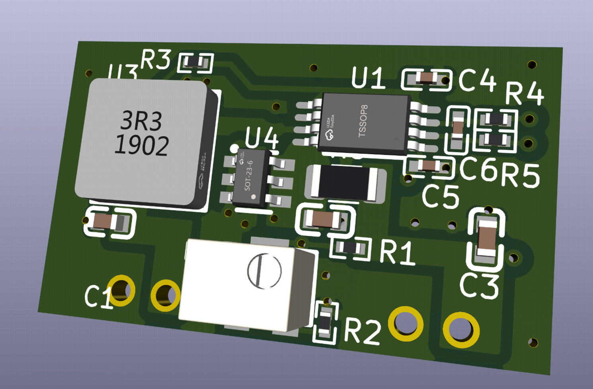

# MicroMPPT

A compact 5W SPV1040-based MPPT (Maximum Power Point Tracking) solar charge controller designed with Meshtastic clients in mind.



## Overview

MicroMPPT is a tiny high-efficiency MPPT battery charging module based on the SPV1040T chip. It features an autonomous Perturb-and-Observe set point adjustment algorithm designed to continuously adjust the converter operating point in order to maximize power output under a wide range of conditions with a variety of panels/battery chemistries.

- **Input**: Solar panel (up to 5.5V, 5W max)
- **Output**: Configurable for different battery chemistries (try to keep Vgain between Vpv and Vbat reasonable to avoid the SW_Current limit of 1.8A)
- **Topology**: Boost converter with autonomous perturb-and-observe MPPT
- **Features**: Overvoltage protection, efficient energy harvest, compact design

## Block Diagram

```
┌─────────────┐    ┌───────────────┐    ┌────────────────────┐    ┌────────────────┐
│  Solar PV   │    │ OVP Circuit   │    │  MPPT Controller   │    │                │
│  Input      │───►│ (PMOS + Zener)│───►│  (SPV1040T)        │───►│  Battery Load  │
│             │    │               │    │  - Boost Converter │    │                │
└─────────────┘    └───────────────┘    │  - P&O Algorithm   │    └────────────────┘
                                        └────────────────────┘
                                                 │
                                        ┌────────▼─────────┐
                                        │  Sensing Circuit │
                                        │  - Current Sense │
                                        │  - Voltage Div   │
                                        └──────────────────┘
```


## Project Structure

| Path | Description |
|------|-------------|
| `/elec/src/micromppt.ato` | Main circuit definition file using the Atopile language |
| `/elec/src/SPV1040T.ato` | SPV1040T component definition |
| `/elec/layout/default/micromppt.kicad_pcb` | KiCad PCB layout file |
| `/build/builds/default` | Generated build outputs (Gerbers, BOM, 3D models) |

## Features

- **Autonomous MPPT**: Self-adjusting maximum power point tracking using embedded autonomous perturb-and-observe algorithm
- **Multi-chemistry Support**: Configurable for different battery types
- **Compact Design**: Small form facto is built using Atopile.. Adjust output voltage with Vctrl divider.
- **Overvoltage Protection**: Prevents damage from excessive input voltage

## Output Voltage Configuration

The SPV1040T output voltage is set by a resistor divider connected to the VCTRL pin. The relationship between the resistor values and output voltage follows this equation:

$V_{out} = V_{ref} \times (1 + \frac{R1}{R2})$

Where:
- $V_{ref}$ = 1.25V
- R1 and R2 form the voltage divider connected to VCTRL

### Battery Chemistry Configurations

Below are recommended resistor values for various battery chemistries and supercapacitors:

| Battery/Capacitor Type | Charge Voltage | R1 | R2 | Notes |
|--------------|----------------|----|----|-------|
| LiPo (1S) | 4.2V | 1MΩ | 422kΩ | Single cell lithium polymer |
| LiFePO4 (1S) | 3.65V | 750kΩ | 390kΩ | Single cell lithium iron phosphate |
| Lead-acid (2S) | 4.8V | 1MΩ | 351kΩ | Two cell lead acid (2.4V/cell) |
| Supercapacitor (2.7V) | 2.7V | 470kΩ | 600kΩ | Low voltage supercapacitor |
| Supercapacitor (5.5V) | 5.5V | 1MΩ | 294kΩ | High voltage supercapacitor |

To adjust the output voltage for different battery chemistries, you can either:
1. Replace R1 and R2 with the values from the table above
2. Use the adjustable potentiometer (3224W-1-105E) included in the current design to fine-tune the output voltage

## Documentation and Links

- [Project Website](https://eigenlucy.github.io/projects/micromppt/)
- [Hackaday Project Page](https://hackaday.io/project/202610-micromppt)
- [SPV1040 Datasheet](https://www.st.com/resource/en/datasheet/spv1040.pdf)

## Requirements

- This project is built using [Atopile](https://atopile.io/).Check out [ATO_USAGE.md](ATO_USAGE.md) for instructions on installation and use.
- KICAD 9.0 for PCB layout

## License

This project is licensed under the MIT License - see the LICENSE file for details.
